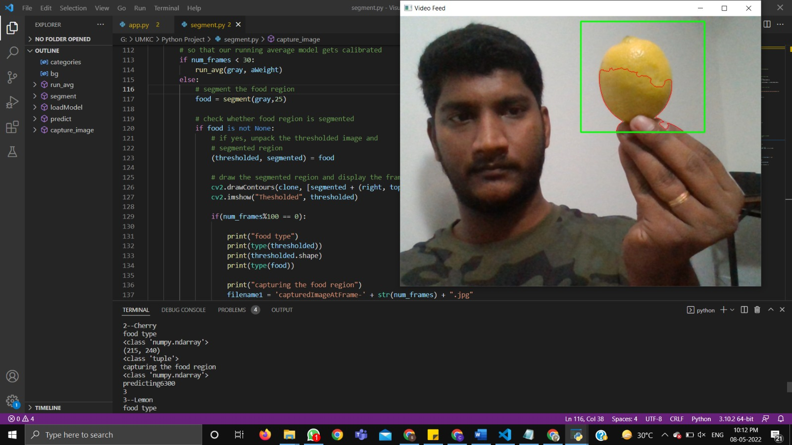
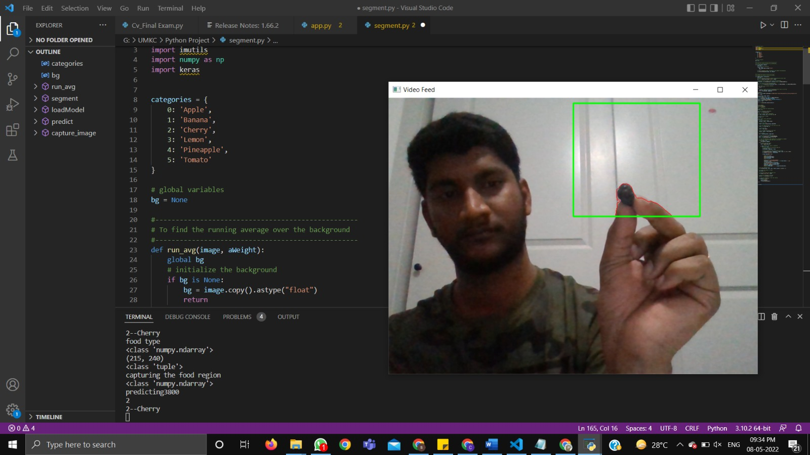

# Food-recognition-model-using-CNN

In this project, we have developed a food recognition model that predicts the food that are captured using the camera and also estimate its calorie, to help patients and dietitians in managing daily food intake.

# Team name : CODE WARS

1. Abhitej Thonupunoori - attxv@umsystem.edu 
2. Manoj Kumar Madireddy - mm68c@umsystem.edu
3. Aravind Kumar Gardas - agbnx@umsystem.edu

# Video Link
```
https:
```
# Overview
The main objective of this project is to recognize the food image. The categories of food include Apple, Banana, Cherry, Lemon, Pineapple, Tomato. After capturing the food the aim is to show that to which category does the image belongs to & estimate the calorie.

# Execution
To run the code type ```python segment.py``` 

# Code requirements
The code requires python version 3.0 or higher, and Jupyter Notebook.

# Libraries
1. NumPy
2. Pandas
3. Keras
4. Open-CV
5. Matplotlib
6. Flask

# Data Source

The data is collected from the reference below. We downloaded the images and seperated into categories as folders in local drive mounted to collab for the code functionality.

https://www.kaggle.com/datasets/aelchimminut/fruits262 

# Food image categories


# Food image samples
 

# Model Summary

Once we have trained the model with the training data, we have evaluated our model using the test data and the model has an accuracy around 60%.

 

# Model Performance
 

# Results

Lemon



Cherry



# Interface
 
